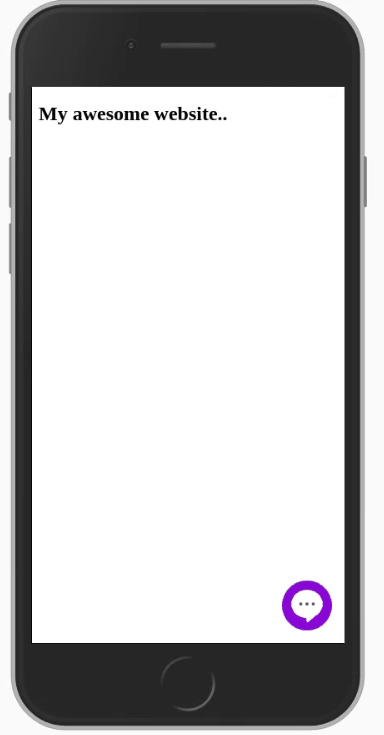

# Adding covid-bot.com to your website.
# Description
This is a simple solution to add covid-bot.com to your website.

covid-bot.com is an AI-powered chatbot created by Innaton Technologies Ltd. and it can answer any question related to COVID-19, provide real-time data and much more.

# Instructions

Copy the code in "covid-embedded.hmtl" and paste it right before the end of the body of your websites' HTML (before the ```</body>``` tag)

That's it! Now your users can benefit from covid-bot.com

Here's the code:
```
<link rel="stylesheet" href="https://rawcdn.githack.com/waelmas/covid-bot/808f824d00ad53532c294cc739dccf24ffd6bdea/static/covid-embed.css">

    <div class="covid-out" id="covid-bot-outer">
       
        <div style="height: 100%;">
        <a href="javascript:closeFrame();">
        </a>

        <iframe id="covid-frame"  src="" scrolling="yes" class="embedded-chat">
        </iframe>
    
        </div>
        </div>

<div id="covid-chat" class="covid-chat"> <a href="javascript:openFrame();">
</a></div>
<script src="https://rawcdn.githack.com/waelmas/covid-bot/808f824d00ad53532c294cc739dccf24ffd6bdea/static/covid-embed.js"></script>
```
# How it looks like

Desktop:


Mobile:



# IMPORTANT

No one is allowed to charge users for the usage of covid-bot.com UNLESS they have a written agreement with us first.
For info reach me at: info@covid-bot.com OR info@innaton.com
